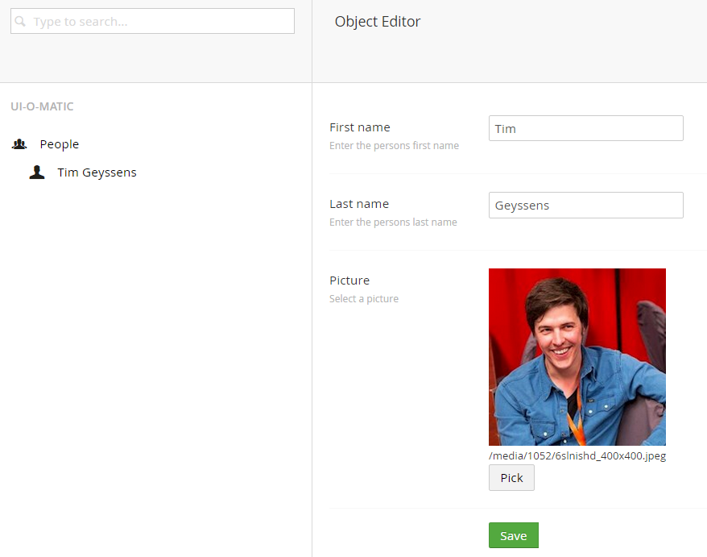

# UI-O-Matic #

**Auto generate an integrated crud UI in Umbraco for a db table based on a [petapoco ](http://www.toptensoftware.com/petapoco/)poco**

Implement an interface and decorate your class and properties with some additional attributes.

## Example ##
If you have the following db table

    CREATE TABLE [People] (
      [Id] int IDENTITY (1,1) NOT NULL
    , [FirstName] nvarchar(255) NOT NULL
    , [LastName] nvarchar(255) NOT NULL
    , [Picture] nvarchar(255) NOT NULL
    );

This class

    [UIOMaticAttribute("People","icon-users","icon-user")]
    [TableName("People")]
    public class Person: IUIOMaticModel
    {
        public Person() { }

        [UIOMaticIgnoreField]
        [PrimaryKeyColumn(AutoIncrement = true)]
        public int Id { get; set; }

        [UIOMaticField("First name","Enter the persons first name")]
        public string FirstName { get; set; }

        [UIOMaticField("Last name", "Enter the persons last name")]
        public string LastName { get; set; }

        [UIOMaticField("Picture", "Select a picture", View = "file")]
        public string Picture { get; set; }

        public override string ToString()
        {
            return FirstName + " " + LastName;
        }

        public IEnumerable<Exception> Validate()
        {
            var exs = new List<Exception>();

            if(string.IsNullOrEmpty(FirstName))
                exs.Add(new Exception("Please provide a value for first name"));

            if (string.IsNullOrEmpty(LastName))
                exs.Add(new Exception("Please provide a value for last name"));

            return exs;
        }
    }`

Will generate the following UI

## Documentation ##

For docs please go to[ http://uiomatic.readthedocs.org/](http://uiomatic.readthedocs.org/)

### Test site ###
Backoffice credentials: 
- tim@nibble.be / password

