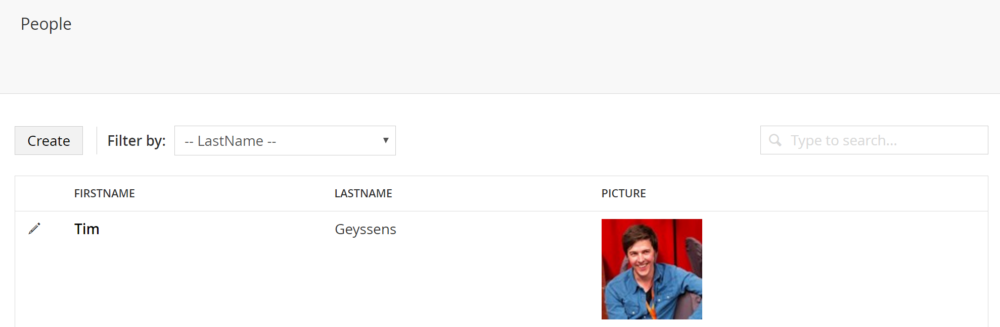

# Listview #

UI-O-Matic also provides the option to display your objects in a listview (since the tree isn't the best choice when working with a lot of data).

## UIOMatic Attribute RenderType Property ##

You can specify the render type on the *UIOMatic* attribute (by default this is set to Tree)

    [UIOMatic("dogs", Dogs", "Dog", FolderIcon = "icon-users", RenderType = UIOMaticRenderType.List)]

Now you won't see the items in the tree anymore but in a list view

You can sort the listview by clicking on the table headers and the listview is also searchable.

## Decorate properties with the UIOMaticListViewField attribute ##
As with the editor, in order for fields to be displayed in the list view, they must be decorated with the *UIOMaticListViewField* attribute

	[UIOMaticListViewField]

You can also specify additional parameters

- Name, a friendly display name for the property, otherwise the property name is used
- Order, sets the order in which this item should appear in the list
- View, if you wish to change the default label view

		[UIOMaticListViewField(View = UIOMatic.Constants.FieldViews.Image)]

There are a couple out of the box views you can use

- label (default)
- image

Besides the out of the box ones you can also use a completely custom one 

    [UIOMaticListViewField(Name = "Location", View = "~/App_Plugins/Example/map.static.html")]

## Adding a list view filter with the UIOMaticListViewFilter attribute ##

When listing a lot of items, you may want to have a way of seeing a sub-view of the list by a given property, for this you can use the `UIOMaticListViewFilter` attribute

    [UIOMaticListViewFilter]

You can also specify additional parameters

- Name, a friendly display name for the filter, otherwise the property name is used
- KeyField, a reference to an alternative model property to use as the unique key whilst still using the current property as the dropdown text (useful if the property is a reference to another model and the decorated property is a `ResultColumn`)
- View, if you wish to change the default dropdown view
- Config, if you wish to pass config data to your custom view (the default view doesn't need any)

By simply applying this attribute to a field, a filter dropdown of all distinct values will be shown which will automatically filter when a selection is made.

