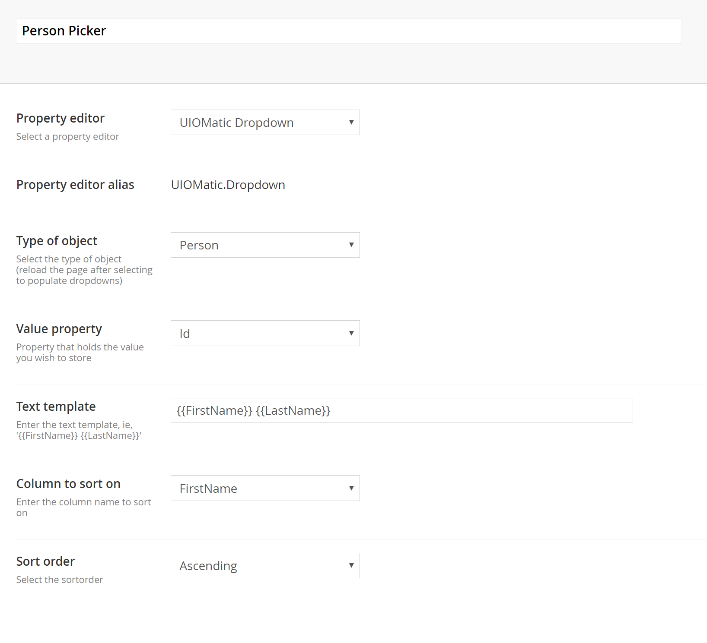
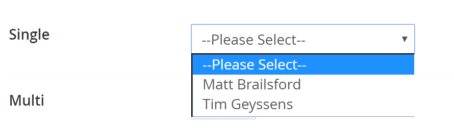

# Property Editor #
UI-O-Matic also comes with a property editor that should make it easy to create object selectors (currently only in dropdown input type) to your Umbraco documents.

## Settings ##

## Result ##

