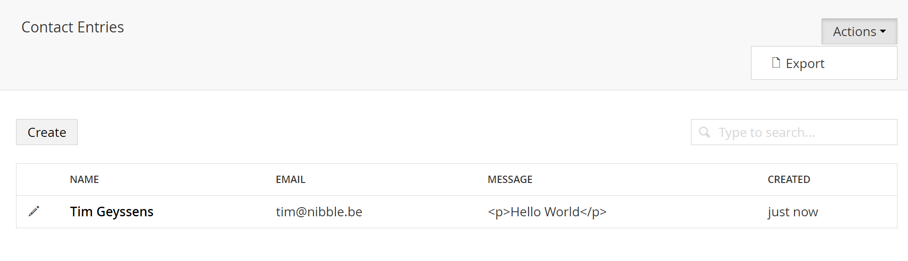

# List View Actions #

By default the [list view](04.Listview.md) offers CRUD functionality but you can further extend this with custom actions.

## UIOMaticAction Attribute ##

    [UIOMaticAction("export", "Export", "~/App_Plugins/UIOMaticAddons/export.html", Icon = "icon-document-dashed-line")]
    public class ExportAction { }

Simply create a new class and mark it with the `UIOMaticAction` attribute, the attribute has a constructor with 3 parameters

- Alias, the unique alias of your action
- Name, the name that is displayed for the action
- View, the view that will be opened

Optionally you can also specify an Icon

## ListActions Parameter on the UIOMatic attribute ##
Besides defining the Action you also need to make sure your models have the action in it's ListActions Collection

    ListViewActions = new[]{ typeof(ExportAction)}

## Result ##

## Complete Example ##
For a complete example please refer to [https://github.com/TimGeyssens/UIOMatic-Addons-Export](https://github.com/TimGeyssens/UIOMatic-Addons-Export) 

