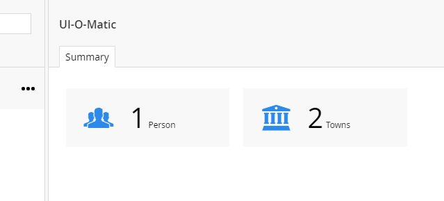

# Dashboard #

UI-O-Matic ships with a default dashboard, you can display the icon and count of items for each of your models by setting the parameter *ShowOnSummaryDashboard* to true on the UIOMatic attribute

    [UIOMatic("people","People","Person", 
		FolderIcon = "icon-users", 
		ItemIcon = "icon-user",
		ShowOnSummaryDashboard = true )]

## Example ##

