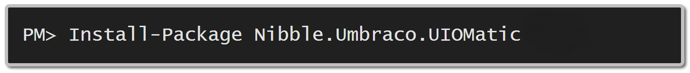
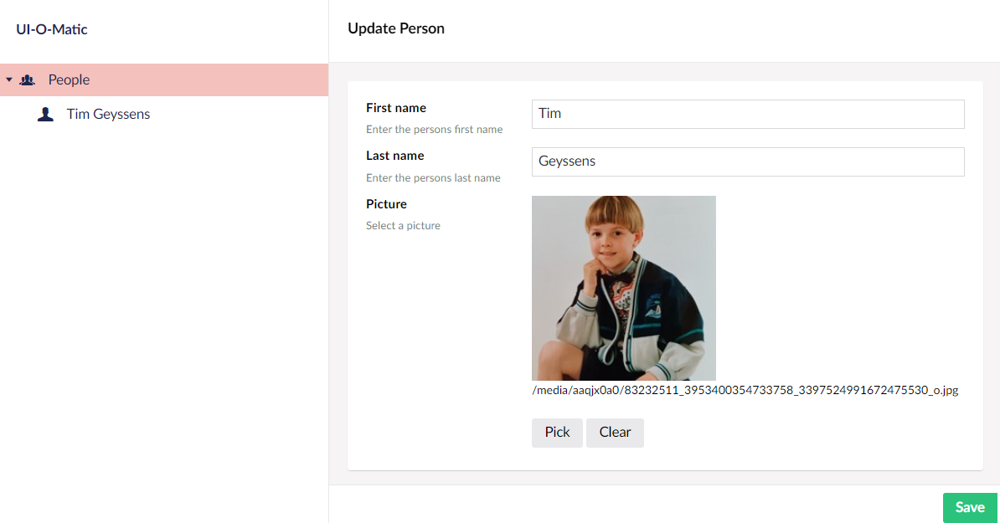
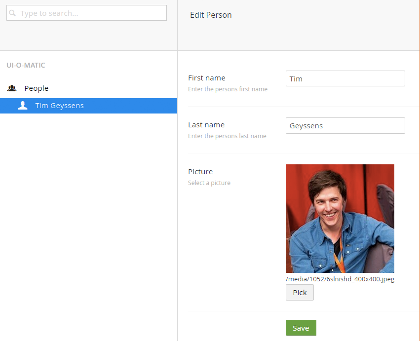

#  #

UI-O-Matic allows you to auto generate an integrated crud UI in Umbraco v7 and v8 for a db table based on a [petapoco](http://www.toptensoftware.com/petapoco/) / [npoco](https://github.com/schotime/NPoco) (the default ORM in Umbraco) poco.

## How can I install it? ##
UI-O-Matic can be installed from the [Nuget package repository](https://www.nuget.org/packages/Nibble.Umbra
co.UIOMatic/), or build manually from the [source-code](https://github.com/TimGeyssens/UIOMatic)

For Umbraco v7 use v2.latest of UI-O-Matic

For Umbraco v8 use v3.latest of UI-O-Matic

## Getting Started ##
Of course make sure that UI-O-Matic is installed, your user has access to the new UI-O-Matic section and then create your poco

### Example  ###
If you have the following db table

    CREATE TABLE [People] (
      [Id] int IDENTITY (1,1) NOT NULL
    , [FirstName] nvarchar(255) NOT NULL
    , [LastName] nvarchar(255) NOT NULL
    , [Picture] nvarchar(255) NOT NULL
    );

And the following petapoco/npoco poco

    [TableName("People")]
    public class Person
    {

        [PrimaryKeyColumn(AutoIncrement = true)]
        public int Id { get; set; }

        public string FirstName { get; set; }

        public string LastName { get; set; }

        public string Picture { get; set; }

    }

The next additions to the class (attributes)

    [UIOMatic("people","People","Person", FolderIcon = "icon-users", ItemIcon = "icon-user")]
    [TableName("People")]
    public class Person
    {
        [PrimaryKeyColumn(AutoIncrement = true)]
        public int Id { get; set; }

		[Required]
        [UIOMaticField(Name = "First name", Description = "Enter the persons first name")]
        public string FirstName { get; set; }

		[Required]	
        [UIOMaticField(Name = "Last name",Description = "Enter the persons last name")]
        public string LastName { get; set; }

        [UIOMaticField(Name = "Picture",Description = "Select a picture", View =  UIOMatic.Constants.FieldEditors.File)]
        public string Picture { get; set; }

        public override string ToString()
        {
            return FirstName + " " + LastName;
        }

    }

will generate the following crud UI

v8

v7

# UIOMatic Documentation #

## Table of Contents ##

1. [Usage](01.Usage.md)
2. [Default Editor Views](02.DefaultEditorViews.md)
3. [Custom Editor Views](03.CustomEditorViews.md)
4. [Custom List Views](04.CustomListViews.md)
5. [Custom Actions](05.CustomActions.md)
6. [Custom Validators](06.CustomValidators.md)
7. [Custom Field Types](07.CustomFieldTypes.md)
8. [Custom Field Editors](08.CustomFieldEditors.md)
9. [Custom Field Views](09.CustomFieldViews.md)
10. [Custom Field Validators](10.CustomFieldValidators.md)
11. [Custom Field Actions](11.CustomFieldActions.md)
12. [Custom Field Types](12.CustomFieldTypes.md)
13. [Custom Field Editors](13.CustomFieldEditors.md)
14. [Custom Field Views](14.CustomFieldViews.md)
15. [Custom Field Validators](15.CustomFieldValidators.md)
16. [SPA and Front.API](16.SPAAndFrontAPI.md)

## Overview ##

UIOMatic is a framework that allows you to create custom database tables and manage them through the Umbraco backoffice. It also provides a standalone SPA and Front.API for managing your data without Umbraco.

## Features ##

- Create and manage custom database tables
- Integrate with Umbraco backoffice
- Standalone SPA and Front.API
- Custom editor views
- Custom list views
- Custom actions
- Custom validators
- Custom field types
- Custom field editors
- Custom field views
- Custom field validators
- Custom field actions

## Getting Started ##

1. Install the required NuGet packages
2. Decorate your classes with the `UIOMatic` attribute
3. Decorate your properties with the `UIOMaticField` attribute
4. Configure your database connection
5. Start using UIOMatic!

For more detailed instructions, see the [Usage](01.Usage.md) documentation.

## Standalone Usage ##

If you don't want to use Umbraco, you can use the standalone Front.API and SPA components. See the [SPA and Front.API documentation](16.SPAAndFrontAPI.md) for more details.

## Contributing ##

Contributions are welcome! Please see the [Contributing Guidelines](CONTRIBUTING.md) for more details.

## License ##

UIOMatic is licensed under the MIT License. See the [License](LICENSE) file for more details.

