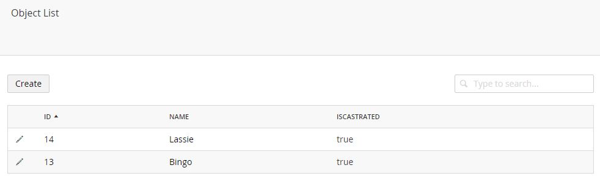

# Listview #

UI-O-Matic also provides the option to display your objects in a listview (since the tree isn't the best choice when working with a lot of data).

## UIOMatic Attribute RenderType Property ##

You can specify the render type on the *UIOMatic* attribute (by default this is set to Tree)

    [UIOMatic("Dogs", "icon-users", "icon-user", RenderType = UIOMaticRenderType.List)]

Now you wont see the items in the tree anymore but in a list view

You can sort the listview by clicking on the table headers and the listview is also searchable.

## Decorate properties with the UIOMaticIgnoreFromListView attribute ##
If you wish to exlude certain properties from being displayed in the listview you can do so by marking your properties with the *UIOMaticIgnoreFromListView* attribute

	[UIOMaticIgnoreFromListView]

